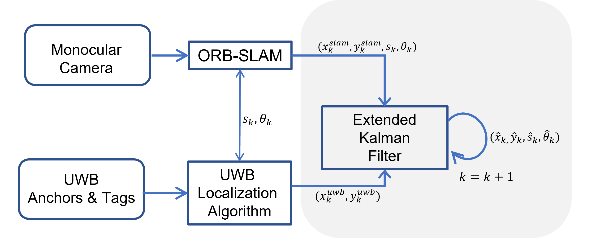

Fusion localization through V2X
================================= 
본 리파지토리는 KETI 실내 위치 추정 시스템(IPE)의 센서 융합을 담당하는 컴포넌트 개발 코드이다. 다수 센서(Camera, UWB, IMU)들을 융합하여 측위 추정 결과를 추정하는 EKF(Extended Kalman Filter) 기반 알고리즘을 포함한다. 본 코드는 MATLAB으로 개발되었으며 IPE 시스템 다른 모듈과의 결합을 위해 coverter를 이용하여 C언어로 변환된다. 변환된 코드는 codegen 폴더에 위치한다.  

## 폴더 구성 
* MapParameter 
ORB-SLAM 결과와 UWB Localization 결과와의 초기 좌표계 matching 파라미터 데이터 포함 (s_k, theta_k) 

* bagfiles 
Fusion Algorithm의 input에 해당하는 소스 데이터 

* codegen 
MATLAB to C 컨버터로 MATLAB Coder를 사용하였으며 변환된 C코드는 codegen에 위치함

* source
EKF 기반 센서 퓨전 알고리즘 개발 코드. Topfile은 TestBag_2024625_SLAM_UWB_IMU.m 에 해당. IPE에 이식되는 컴포넌트 핵심 모듈은 PositioningSystem_V5_1.m 에 해당. 

